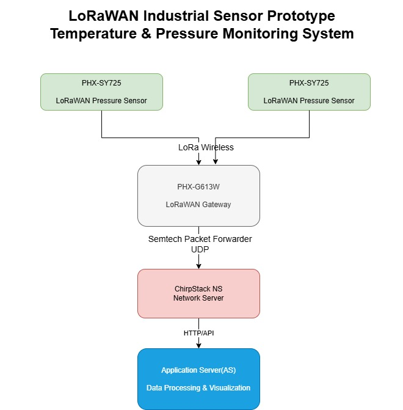
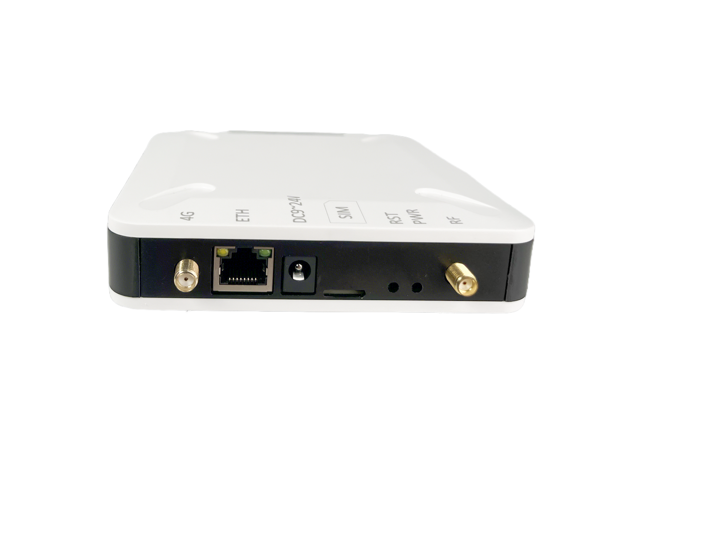
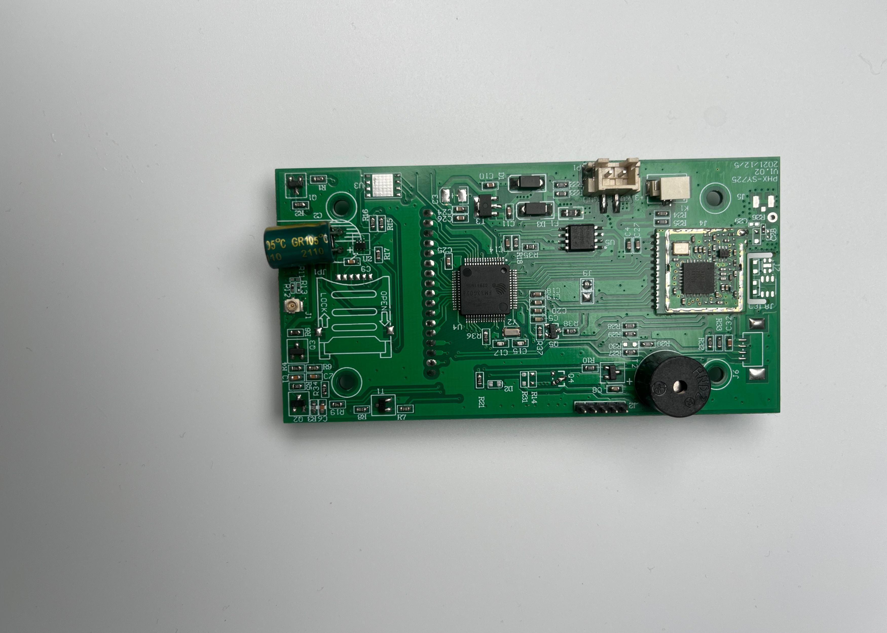

# LoRaWAN Industrial Sensor Prototype — Temperature & Pressure Monitoring

A low-power LoRaWAN sensor node prototype for industrial temperature
and pressure monitoring, with end-to-end integration from embedded
firmware to a private LoRaWAN network server.

---

## Overview

This prototype demonstrates a complete LoRaWAN sensor system suitable
for industrial environments where Wi-Fi and cellular coverage are
unavailable or impractical.

The sensor node samples temperature and pressure data and transmits it
over LoRaWAN Class A to a private network server. The gateway uses the
Semtech Packet Forwarder to route packets to a self-hosted ChirpStack
instance, where data can be forwarded to backend monitoring services.

---

## System Architecture

---

## Hardware Components

| Component | Description |
|---|---|
| MCU | Main controller for sensor reading and LoRaWAN stack |
| LoRa Transceiver | SX1276, 470 MHz |
| Sensor | I2C temperature and pressure sensor |
| LoRaWAN Gateway | Semtech Packet Forwarder |
| Power | Battery-powered, low power design |

---

## Software Stack

| Layer | Technology |
|---|---|
| Device Firmware | Embedded C |
| LoRaWAN Stack | Class A, OTAA join |
| Packet Forwarding | Semtech UDP Packet Forwarder |
| Network Server | ChirpStack (self-hosted) |
| Data Output | MQTT / HTTP integration ready |

---

## Key Features

- LoRaWAN Class A for maximum battery efficiency
- OTAA (Over-the-Air Activation) device join
- I2C sensor integration for temperature and pressure
- 5-second sampling interval with configurable uplink period
- Semtech Packet Forwarder to ChirpStack network server
- Decoded payload ready for backend or cloud integration
- Suitable for industrial environments without Wi-Fi or cellular

---

## LoRaWAN Configuration

| Parameter | Value |
|---|---|
| Region | CN470 |
| Activation | OTAA |
| Class | Class A |
| Spreading Factor | Configurable (SF7–SF12) |
| Sampling Interval | 5 seconds |

---

## Data Flow

1. Sensor node wakes from sleep
2. MCU reads temperature and pressure over I2C
3. Data is encoded into a LoRaWAN uplink payload
4. SX1276 transmits the packet over 470 MHz
5. LoRaWAN gateway receives and forwards via Semtech Packet Forwarder
6. ChirpStack network server decodes the payload
7. Data is available via MQTT or HTTP for backend integration

---

## My Role

This was a solo prototype development project. My responsibilities included:

- Hardware schematic design and prototype assembly
- SX1276 LoRa transceiver driver development in embedded C
- LoRaWAN Class A stack integration and OTAA join implementation
- I2C sensor driver development and data encoding
- RF parameter tuning and link budget testing
- Semtech Packet Forwarder setup and gateway configuration
- ChirpStack network server deployment and device registration
- End-to-end payload verification and uplink testing

---

## Photos

---

## Related Skills

`LoRaWAN` `LoRa` `SX1276` `ChirpStack` `Semtech Packet Forwarder`
`Embedded C` `I2C` `OTAA` `Class A` `IoT Prototyping` `RF Tuning`
